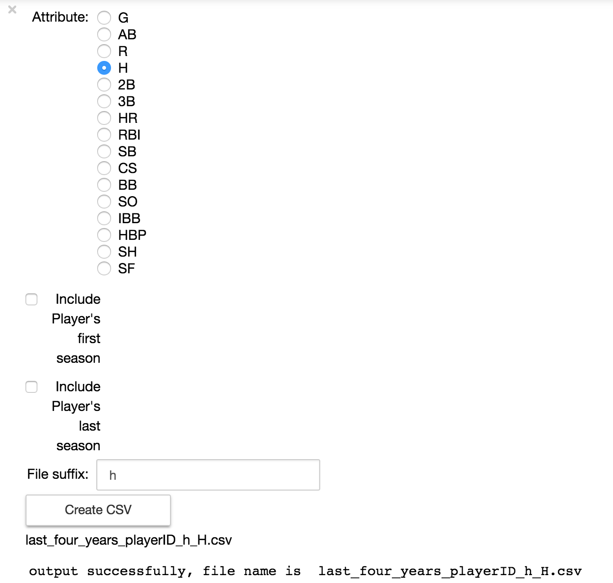

# CSC 590: Baseball predict fourth season

The goal of this project is to use Weka to make a prediction on how a player will perform in their fourth season on any given statistic.

## Favorite Toy Predictions

This project is based off of the formula embedded in the the favorite toy algorithm for predicting the future seasons of a player by using that attribute's previous three seasons.

The [formula is referenced from Baseball Reference](http://www.baseball-reference.com/bullpen/Favorite_toy) and it looks like this:
```
Established level for that statistic = (last season*3+second to last season*2+third to last season)/6. Additionally, the established level should not be below 3/4 of the total in the most recent season
```

Our goal, is to improve this established statistic.

## Data Transformation

Baseball statistical data is based off the [baseballdatabank provided by chadwickbureau](https://github.com/chadwickbureau/baseballdatabank).

We reference these files such as `./Master.csv`, `./Batting.csv`, etc in the codebase, but we are not including them.

### Transformation 1

The first transformation joins all statistics between playerIDs and birthYears available from Master.csv and the stats in the other data files. Then, it also aggregates player-years with multiple stints (So, if player hits 30 on one team, switches teams, then hits 10 on next team, we are outputted 40 hits for that player-year entry).

**Output**

| playerID  | yearID |`B_G`|`B_AB`|`B_R`|`B_H`| ... |
|===========|========|=====|======|=====|=====|=====|
| aaronha01 |   1954 | 122 |  468 |  58 | 131 | ... |
| aaronha01 |   1955 | 153 |  602 | 105 | 189 | ... |
| aaronha01 |   1956 | 153 |  609 | 106 | 200 | ... |
| aaronha01 |   1957 | 151 |  615 | 118 | 198 | ... |

Transformation 1 has been implemented with two solutions, [one in Python by Frank Giddens](transform-1_aggregate-stats_frank), and [another using SQLite commands by Cole Lawrence](./transform-1_aggregate-stats-alt_cole)

### Transformation 2

The second tranformation takes the output of the first transformation to
rotate the data into groups of four consecutive seasons for analysis.

This has been written as a [Jupyter notebook by Jia](./transform-2_four-seasons_jia/four_seasons.ipynb).

And generates the appropriate file based on the gui selections made.



**Output**

[`last_four_years_playerID_H.csv`](transform-2_four-seasons_jia/last_four_years_playerID_H.csv)

|  playerID | yearID | season1 | season2 | season3 | season4 |
|===========|========|=========|=========|=========|=========|
| blowemi01 |   1990 |      27 |       7 |      14 |     106 |
| blowemi01 |   1991 |       7 |      14 |     106 |      78 |
| blowemi01 |   1992 |      14 |     106 |      78 |     113 |
| blowemi01 |   1993 |     106 |      78 |     113 |      84 |
| blowemi01 |   1994 |      78 |     113 |      84 |      44 |
| blowemi01 |   1995 |     113 |      84 |      44 |      97 |
| hillech01 |   1962 |     166 |      93 |      37 |      69 |

### Transformation 3

Finally, we've added a rudimentary age using the Master.csv data's birthYear difference from yearID.

[Notes by Cole](transform-3_add-age_cole/)

**Output**

[`aH.csv`](transform-3_add-age_cole/aH.csv)

|  playerID | age | season1 | season2 | season3 | season4 |
|===========|=====|=========|=========|=========|=========|
| blowemi01 |  25 |      27 |       7 |      14 |     106 |
| blowemi01 |  26 |       7 |      14 |     106 |      78 |
| blowemi01 |  27 |      14 |     106 |      78 |     113 |
| blowemi01 |  28 |     106 |      78 |     113 |      84 |
| blowemi01 |  29 |      78 |     113 |      84 |      44 |
| blowemi01 |  30 |     113 |      84 |      44 |      97 |
| hillech01 |  28 |     166 |      93 |      37 |      69 |


### Analysis

Using aH with Weka, we generated a MultiLayerPeceptron which predicts the next season slightly better (based on RMSE) than the given favorite toy algorithm.

First, we removed the playerID in Weka since it has no impact on the prediction.

> Weka Output by Luke
```
=== Run information ===

Scheme:       weka.classifiers.functions.MultilayerPerceptron -L 1.0E-4 -M 0.8 -N 500 -V 0 -S 0 -E 20 -H 1
Relation:     aH-weka.filters.unsupervised.attribute.Remove-R1
Instances:    15288
Attributes:   5
              age
              season1
              season2
              season3
              season4
Test mode:    10-fold cross-validation

=== Cross-validation ===
=== Summary ===

Correlation coefficient                  0.787 
Mean absolute error                     27.0251
Root mean squared error                 35.2075
Relative absolute error                 54.5381 %
Root relative squared error             61.6919 %
Total Number of Instances               15288

=== Classifier model (full training set) ===

Linear Node 0
    Inputs    Weights
    Threshold    0.8715162361894145
    Node 1    -2.401644381414173
Sigmoid Node 1
    Inputs    Weights
    Threshold    -0.4572899491333346
    Attrib age    0.3634397049893566
    Attrib season1    -0.22933013948740666
    Attrib season2    -0.3351816832189221
    Attrib season3    -1.0542434135515057
Class 
    Input
    Node 0

Time taken to build model: 2.91 seconds
```

